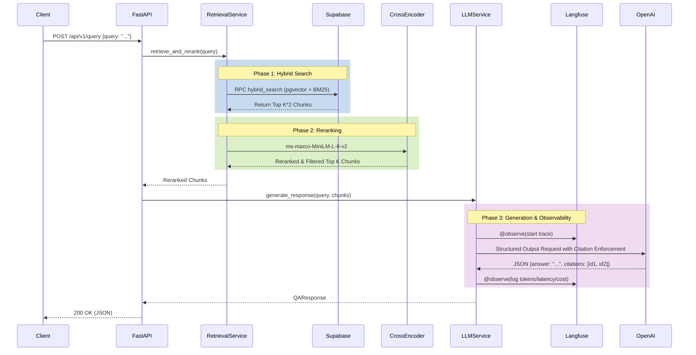

# Production-Grade RAG Backend

A FAANG-grade, production-ready Retrieval-Augmented Generation (RAG) backend engineered with strict offline evaluation, rigorous citation enforcement, and comprehensive observability.

## 🏗 System Architecture

The application is built on **FastAPI** and uses **Supabase** (pgvector + Postgres Full-Text Search) for hybrid retrieval. Retrieved chunks are re-ranked using a HuggingFace **Cross-Encoder**, and the final generation is powered by OpenAI's structured outputs with strict citation rules, fully instrumented via **Langfuse**.



## 🚀 Local Development

Follow these steps to spin up the environment locally:

### 1. Prerequisites
- Python 3.10+
- [Supabase CLI](https://supabase.com/docs/guides/cli)
- Docker (for local Supabase)

### 2. Environment Setup
Clone the repository and install dependencies:
```bash
git clone https://github.com/hemanth2k6/production-grade-rag.git
cd production-grade-rag
python3 -m venv venv
source venv/bin/activate
pip install -r requirements.txt
```

### 3. Local Supabase & Database Setup
Spin up the local Supabase container and apply the `pgvector` schemas:
```bash
supabase start
# Pushes the migrations in supabase/migrations/
supabase db push
```

### 4. Environment Variables
Create a `.env` file in the root directory:
```env
OPENAI_API_KEY=your_openai_key
SUPABASE_URL=http://localhost:54321
SUPABASE_KEY=your_local_anon_key
LANGFUSE_PUBLIC_KEY=your_langfuse_public
LANGFUSE_SECRET_KEY=your_langfuse_secret
LANGFUSE_HOST=https://cloud.langfuse.com
```

### 5. Run the API
```bash
uvicorn app.main:app --reload
```

## 🧪 Evaluation-Driven Development

This repository enforces strict CI/CD regression gating for RAG performance using [Ragas](https://docs.ragas.io/).

Whenever code is pushed or a PR is opened against `main`, the GitHub Actions pipeline runs an offline evaluation against our **Golden Dataset** (`evals/golden_dataset.json`).

### The Faithfulness Gate
We evaluate the LLM's outputs to ensure hallucinations are structurally impossible. The CI script measures **Faithfulness** (are the claims strictly supported by the context?). 
- If the aggregate Faithfulness score drops below **0.85**, the pipeline **fails the build** (Exit Code `1`).
- This mathematically guarantees that degraded RAG pipelines cannot be merged into production.

## 🌍 Deployment

### 1. Database Deployment (Supabase)
The database is managed via Supabase CLI. When merging to `main`, the GitHub Actions pipeline automatically applies migrations to production:
```bash
supabase link --project-ref $SUPABASE_PROJECT_ID
supabase db push
```

### 2. Compute Deployment (Render)
The FastAPI web service is deployed on Render via Infrastructure-as-Code (`render.yaml`).
Upon a successful merge and database migration, the CI/CD pipeline triggers the Render deployment webhook to deploy the latest image.

```yaml
# render.yaml configuration
buildCommand: "pip install -r requirements.txt"
startCommand: "uvicorn app.main:app --host 0.0.0.0 --port $PORT"
```
